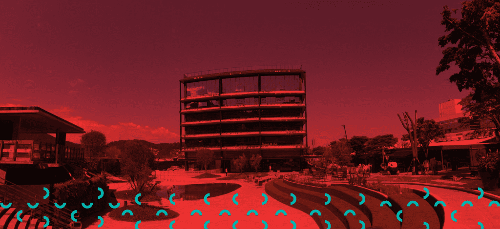

<h1>Atividade - Jean Janrley</h1>

	Objetivo: criar uma landing page responsiva, que foi passada via e-mail pela empresa. 
	Desafios em Js: Fazer os Card's a arte Ilustrativa interagir com o usuário. 

 

<h1>Diferenciais</h1>
<ul>
	<li>[-] Utilizar o automatizador de tarefas gulp</li>
	<li>[x] Utilizar SASS</li>
	<li>[-] Utilizar Jquery</li>
	<li>[x] Inserir transições, animações e efeitos de hover em elementos clicáveis a fim de aprimorar a UX</li>
</ul>

<h1>Sobre as escolhas das técnologias</h1>

	Busquei desenvolver o meu projeto sob as recomendações da empresa, baseado nas técnologias que a empresa considera como diferenciais.

	<h2>Porque não usei GULP?</h2>

	Como estrou usando o Vite Vanilla para construção do projeto, não foi necessário usar o GULP aqui pois o vite faz build do projeto nativame com Es Mododules, sem necessidade do Gulp ou Webpack.

<h2>Porque usei SASS</h2>

	Como a empresa permitiu o uso dessa técnologia e considerou como um diferencial, optei por desenvolver os estilos da página com ela, pois já tenho experiência com e a mesma além da sua fácilidade como seletores CSS, sua sintaxe mais atrente e etc.

<h1>O que achei sobre o projeto</h1>

	Achei muito gratificante ter chegado a esta etapata do processo, através deste projeto eu desenvolvi ainda mais as minhas habilidades, apliquei melhor alguns conceitos de responsividade e estruturei o meu código da melhor forma.

<h1>Link do projeto em produção</h1>

	https://atividade-landing-page.vercel.app/

<h1>Instalação</h1>

	Após clonar o projeto, entre no repositório, abra o terminal e escreva

	"npm install" ou "yarn start"

	O gerenciador de pacotes escolhido irá instalar todas as dependencias do projeto.

<h2>Dev</h2>

	yarn dev

<h2>Build</h2>

	yarn build

<h2>Preview</h2>

	yarn preview

